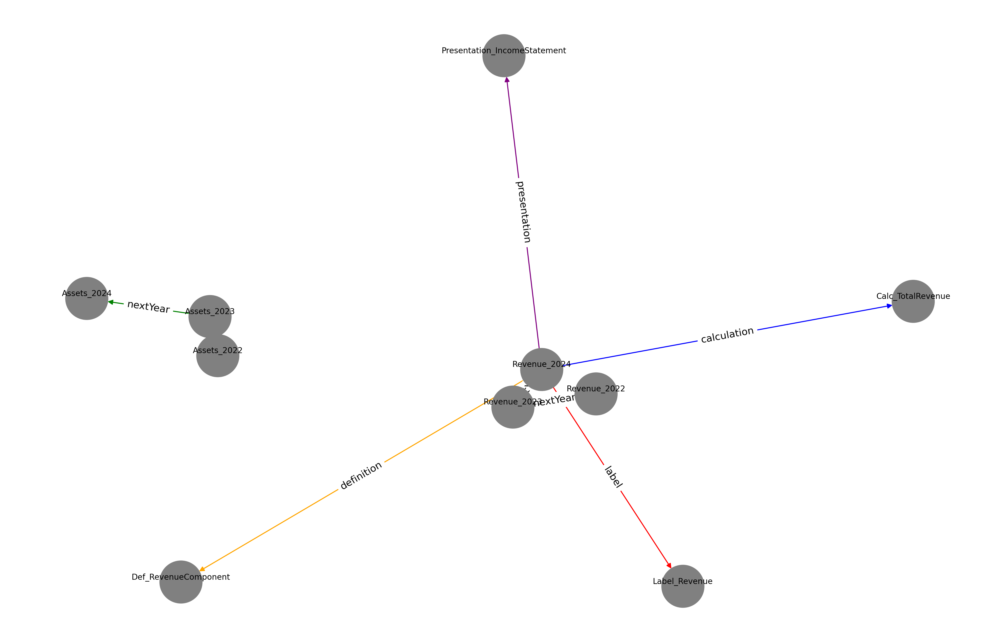

# Amazon XBRL to RDF Knowledge Graph

## Tools Used

* Python 3.x
* RDFLib (for RDF creation)
* NetworkX and Matplotlib (for visualization)
* Gremlin Python (for Neptune DB insertion)
* AiohttpTransport for secure WebSocket

## Steps

1. Parsed `amzn-20241231_htm.xml` to extract key XBRL facts.
2. Extracted `Revenue`, `Assets`, `NetIncomeLoss`, and `OperatingIncomeLoss` with associated years and values.
3. Created RDF triples using RDFLib with a custom `ex:` namespace.
4. Added simulated linkbase edges for `label`, `presentation`, `calculation`, and `definition` linkbases.
5. Built a custom temporal linkbase using `ex:nextYear` to connect the same concept across 2022, 2023, and 2024.
6. Exported all RDF data to `xbrl_neptune_output.ttl` in Turtle format.
7. Uploaded RDF data to Amazon Neptune using Gremlin queries.
8. Visualized a focused graph of key facts using NetworkX and exported it as `xbrl_graph_visualization.png` in the same folder.

## Graph Highlights

* Nodes include XBRL financial metrics with descriptions (concept, year, value).
* Edges distinguish linkbases: green (`nextYear`), red (`label`), purple (`presentation`), blue (`calculation`), orange (`definition`).
* Visual output below shows relationships and temporal progression:



## SPARQL Query Example (for GraphDB alternative)

```sparql
SELECT ?year ?value WHERE {
  ?fact ex:concept "Revenue" .
  ?fact ex:year ?year .
  ?fact ex:value ?value .
}
```

## Assumptions

* The XBRL file is structured according to standard FASB US-GAAP taxonomy.
* Linkbases are simulated for visualization.
* Temporal transitions only span from 2022 → 2023 → 2024.
